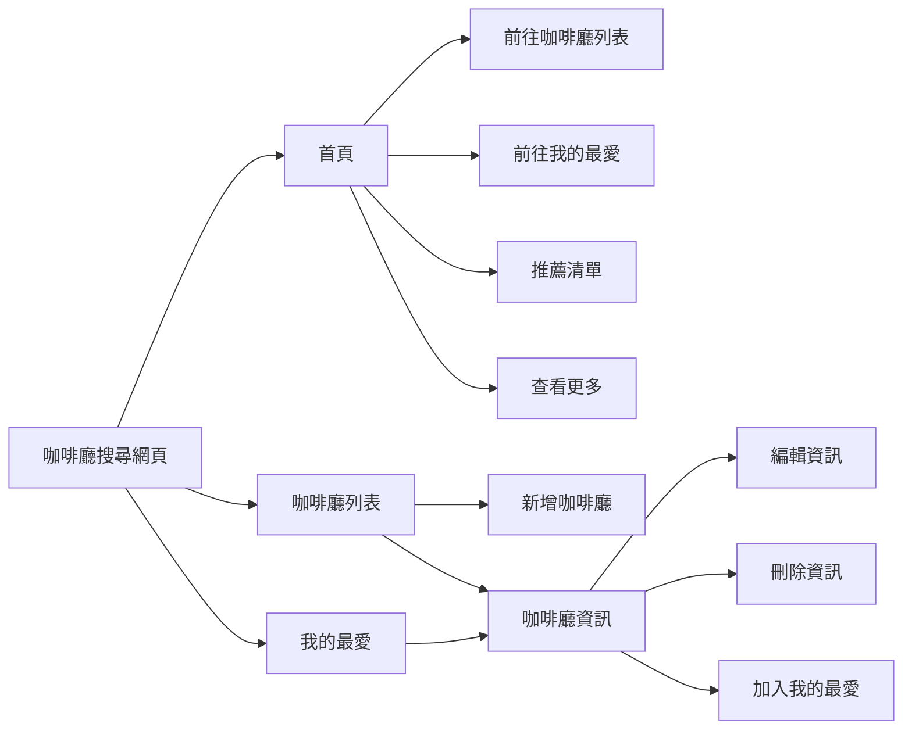

## Source Code

此專案採前後端分離製作

### [Frontend](https://github.com/wendy60113/coffeeShopCollection)

### [Backend](https://github.com/wendy60113/coffeeshopApi)

---

## Introduction

### Functional Map



---

### Flow Chart


---

## API 文件

### Schema

<details>
 <summary>
    <strong>User List</strong>
</summary>

> | name | data type | requried | description |
> | ---- | --------- | -------- | ----------- |
> | id   | int       |          | 自動產生 id |
> | name | string    | Y        | 使用者帳號  |

</details>

<details>
 <summary>
    <strong>Cafe List</strong>
</summary>

> | name       | data type | requried | description               |
> | ---------- | --------- | -------- | ------------------------- |
> | id         | int       |          | 自動產生 id               |
> | name       | string    | Y        | 咖啡廳名稱                |
> | address    | string    | Y        | 咖啡廳地址                |
> | isFavorite | string    |          | 自動產生 (0:false,1:true) |

</details>

<details>
 <summary>
    <strong>Favorite List</strong>
</summary>

> | name       | data type | requried | description |
> | ---------- | --------- | -------- | ----------- |
> | id         | int       |          | 自動產生 id |
> | cafeshopId | int       | Y        | 咖啡廳編號  |
> | userId     | int       | Y        | 使用者編號  |

</details>

### API

<details>
 <summary>
    <strong>Cafelist</strong>
</summary>
<details>
    <summary>
        <strong style={{backgroundColor:'#4ac057',color:'#fff',padding:5+'px',marginRight:10+'px'}}>POST</strong>
        <strong style={{marginRight:10+'px'}}>/cafelist/query</strong>
        <strong>查詢咖啡廳資料列表</strong>
    </summary>

#### Parameters

none

#### Request body

```js
//example
{
    "userId": "1"
}
```

#### Response

> | http code | response |
> | --------- | -------- |
> | 200       | results  |
> | 400       | error    |

</details>

<details>
    <summary>
        <strong style={{backgroundColor:'#4ac057',color:'#fff',padding:5+'px',marginRight:10+'px'}}>POST</strong>
        <strong style={{marginRight:10+'px'}}>/cafelist/add</strong>
        <strong>新增咖啡廳資料</strong>
    </summary>

#### Parameters

none

#### Request body

```js
//example
{
  "name": "shop name",
  "address": "shop address"
}
```

#### Response

> | http code | response |
> | --------- | -------- |
> | 200       | results  |
> | 400       | error    |

</details>
<details>
    <summary>
        <strong style={{backgroundColor:'#40a0de',color:'#fff',padding:5+'px',marginRight:10+'px'}}>GET</strong>
        <strong style={{marginRight:10+'px'}}>/cafelist/:id</strong>
        <strong>查詢咖啡廳單筆資料</strong>
    </summary>

#### Parameters

> | name | requried | description |
> | ---- | -------- | ----------- |
> | id   | Y        | 咖啡廳 id   |

#### Request body

none

#### Response

> | http code | response     |
> | --------- | ------------ |
> | 200       | results      |
> | 400       | error        |
> | 404       | 找不到此項目 |

</details>
<details>
    <summary>
        <strong style={{backgroundColor:'#ffa524',color:'#fff',padding:5+'px',marginRight:10+'px'}}>PUT</strong>
        <strong style={{marginRight:10+'px'}}>/cafelist/:id</strong>
        <strong>編輯咖啡廳單筆資料</strong>
    </summary>

#### Parameters

none

#### Request body

```js
{
  "name": "shop name",
  "address": "shop address",
  "id": "306"
}
```

#### Response

> | http code | response |
> | --------- | -------- |
> | 200       | results  |
> | 400       | error    |

</details>
<details>
    <summary>
        <strong style={{backgroundColor:'#ff6565',color:'#fff',padding:5+'px',marginRight:10+'px'}}>DELETE</strong>
        <strong style={{marginRight:10+'px'}}>/cafelist/:id</strong>
        <strong>刪除咖啡廳單筆資料</strong>
    </summary>

#### Parameters

> | name | requried | description |
> | ---- | -------- | ----------- |
> | id   | Y        | 咖啡廳 id   |

#### Request body

none

#### Response

> | http code | response     |
> | --------- | ------------ |
> | 200       | results      |
> | 400       | error        |
> | 404       | 找不到此項目 |

</details>
</details>
<details>
 <summary>
    <strong>Favorite</strong>
</summary>
<details>
    <summary>
        <strong style={{backgroundColor:'#40a0de',color:'#fff',padding:5+'px',marginRight:10+'px'}}>GET</strong>
        <strong style={{marginRight:10+'px'}}>/favorite</strong>
        <strong>查詢我的最愛資料列表</strong>
    </summary>

#### Parameters

none

#### Request body

none

#### Response

> | http code | response          |
> | --------- | ----------------- |
> | 200       | {Msg:Msg,list:[]} |
> | 400       | error             |

</details>
<details>
    <summary>
        <strong style={{backgroundColor:'#4ac057',color:'#fff',padding:5+'px',marginRight:10+'px'}}>POST</strong>
        <strong style={{marginRight:10+'px'}}>/favorite</strong>
        <strong>新增我的最愛單筆資料</strong>
    </summary>

#### Parameters

none

#### Request body

```js
{
  "cafeshopId": 201,
  "userId": 1
}
```

#### Response

> | http code | response |
> | --------- | -------- |
> | 200       | result   |
> | 400       | error    |

</details>
<details>
    <summary>
        <strong style={{backgroundColor:'#ff6565',color:'#fff',padding:5+'px',marginRight:10+'px'}}>DELETE</strong>
        <strong style={{marginRight:10+'px'}}>/favorite/:userId/:cafeshopId</strong>
        <strong>刪除我的最愛單筆資料</strong>
    </summary>

#### Parameters

> | name       | requried | description    |
> | ---------- | -------- | -------------- |
> | userId     | Y        | userlist -> id |
> | cafeshopId | Y        | cafelist -> id |

#### Request body

none

#### Response

> | http code | response |
> | --------- | -------- |
> | 200       | result   |
> | 400       | error    |

</details>
</details>
<details>
 <summary>
    <strong>Userlist</strong>
</summary>
<details>
    <summary>
        <strong style={{backgroundColor:'#40a0de',color:'#fff',padding:5+'px',marginRight:10+'px'}}>GET</strong>
        <strong style={{marginRight:10+'px'}}>/userlist</strong>
        <strong>查詢使用者帳號列表</strong>
    </summary>

#### Parameters

none

#### Request body

none

#### Response

> | http code | response |
> | --------- | -------- |
> | 200       | results  |
> | 400       | error    |

</details>
<details>
    <summary>
        <strong style={{backgroundColor:'#4ac057',color:'#fff',padding:5+'px',marginRight:10+'px'}}>POST</strong>
        <strong style={{marginRight:10+'px'}}>/userlist</strong>
        <strong>新增使用者帳號</strong>
    </summary>

#### Parameters

none

#### Request body

```js
{
  "name": "wendy"
}
```

#### Response

> | http code | response |
> | --------- | -------- |
> | 200       | results  |
> | 400       | error    |

</details>
<details>
    <summary>
        <strong style={{backgroundColor:'#ff6565',color:'#fff',padding:5+'px',marginRight:10+'px'}}>DELETE</strong>
        <strong style={{marginRight:10+'px'}}>/userlist/:id</strong>
        <strong>刪除使用者帳號</strong>
    </summary>

#### Parameters

> | name | requried | description |
> | ---- | -------- | ----------- |
> | id   | Y        | 帳號 id     |

#### Request body

none

#### Response

> | http code | response |
> | --------- | -------- |
> | 200       | results  |
> | 400       | error    |

</details>
</details>
