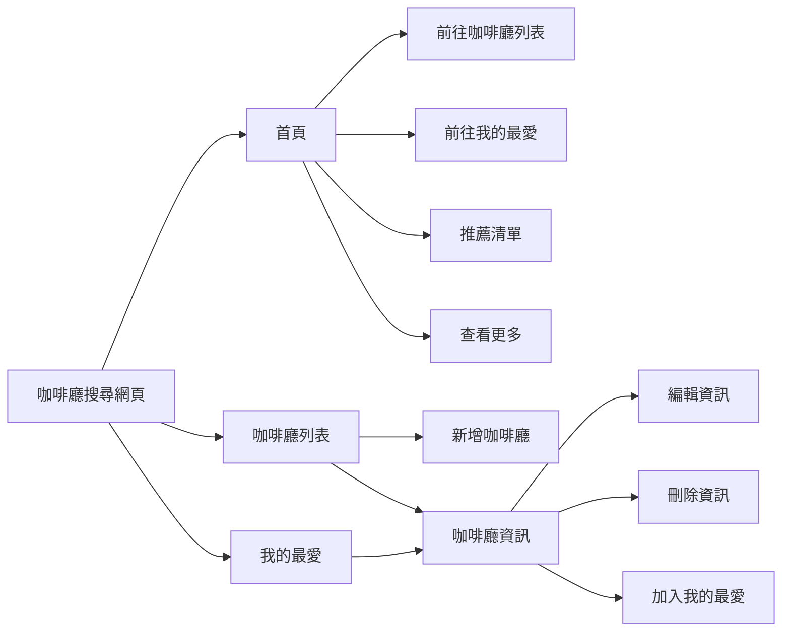

## Introduction

### Functional Map

---

### Flow Chart

---

## API 文件

**Base URL: `https://localhost:3000/api`**

| API            | Method | URL              |
| -------------- | ------ | ---------------- |
| 咖啡廳資料表   |
| 檢視資料列表   | GET    | api/cafeshop     |
| 查詢單筆資料   | GET    | api/cafeshop/:id |
| 新增資料       | POST   | api/cafeshop     |
| 編輯資料       | PUT    | api/cafeshop/:id |
| 刪除資料       | DELETE | api/cafeshop/:id |
| 我的最愛資料表 |
| 檢視資料列表   | GET    | api/favorite     |
| 新增資料       | POST   | api/favorite     |
| 刪除資料       | DELETE | api/favorite/:id |

**咖啡廳資料**

**API:**
查詢咖啡廳資料列表  
**URL:**
https://localhost:3000/api/cafeshop  
**Method :**
GET

**Response Body :**

| Props     | Type    | Required | Default |
| --------- | ------- | -------- | ------- |
| id        | string  | -        | auto    |
| name      | string  | -        | -       |
| address   | string  | -        | -       |
| latitude  | integer | -        | -       |
| longitude | integer | -        | -       |

---

**API :** 查詢咖啡廳單筆資料  
 **URL :** https://localhost:3000/api/cafeshop/:id  
 **Method :** GET

**Response Body :**

| Props     | Type    | Required | Default |
| --------- | ------- | -------- | ------- |
| id        | string  | -        | -       |
| name      | string  | -        | -       |
| address   | string  | -        | -       |
| latitude  | integer | -        | -       |
| longitude | integer | -        | -       |

---

**API:** 新增咖啡廳資料  
**URL:** https://localhost:3000/api/cafeshop  
**Method :** POST

**Request Body :**

| Props   | Type   | Required | Default |
| ------- | ------ | -------- | ------- |
| id      | string | auto     | -       |
| name    | string | yes      | -       |
| address | string | yes      | -       |

---

**API:** 編輯咖啡廳資料  
**URL:** https://localhost:3000/api/cafeshop/:id  
**Method :** PUT  
**Request Body :**

| Props     | Type    | Required | Default | Remark               |
| --------- | ------- | -------- | ------- | -------------------- |
| id        | string  | yes      | -       |                      |
| name      | string  | no       | -       |                      |
| address   | string  | no       | -       |                      |
| latitude  | integer | no       | -       | address 更新自動更新 |
| longitude | integer | no       | -       | address 更新自動更新 |

---

**API:** 刪除咖啡廳資料  
**URL:** https://localhost:3000/api/cafeshop/:id  
**Method :** DELETE

---

**我的最愛資料**

**API:** 檢視我的最愛列表  
**URL:** https://localhost:3000/api/favorite  
**Method :** GET  
**Response Body :**

| Props      |           | Type    | Required | Default |
| ---------- | --------- | ------- | -------- | ------- |
| id         |           | string  | -        | -       |
| cafeshopId |           | string  | -        | -       |
| cafeList   |           | object  | -        | -       |
|            | name      | string  | -        | -       |
|            | address   | string  | -        | -       |
|            | latitude  | integer | -        | -       |
|            | longitude | integer | -        | -       |

---

**API:** 新增我的最愛  
**URL:** https://localhost:3000/api/favorite  
**Method :** POST  
**Request Body :**

| Props      | Type   | Required | Default |
| ---------- | ------ | -------- | ------- |
| id         | string | auto     | -       |
| cafeshopId | string | yes      | -       |

---

**API:** 刪除我的最愛  
**URL:** https://localhost:3000/favorite/:id  
**Method :** DELETE
