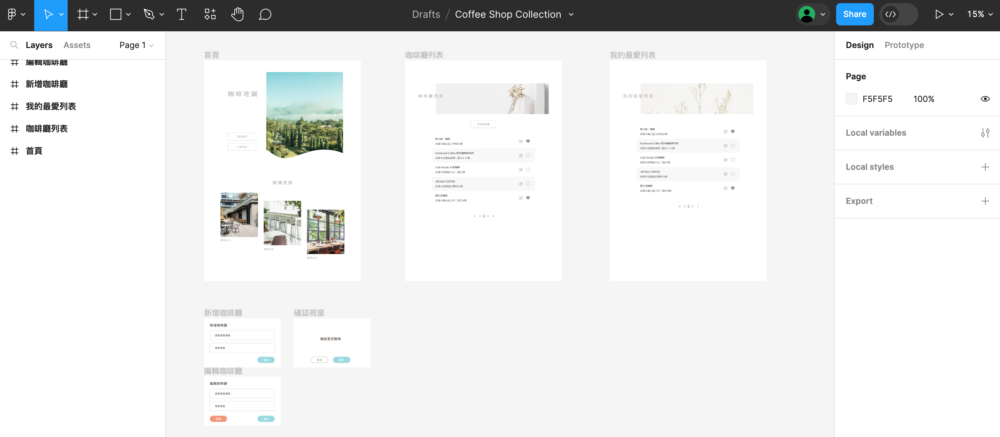
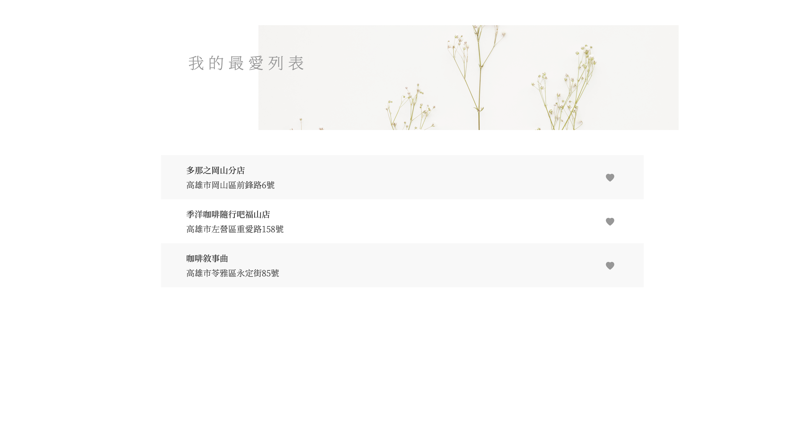
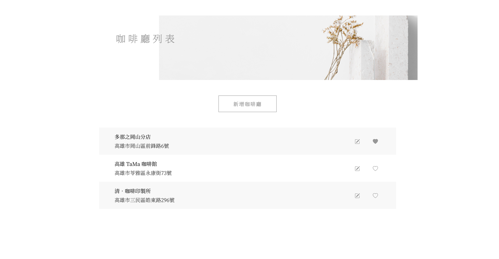

## 簡介

這是一個以 Vue.js 和 Node.js 製作的網頁。此網頁提供使用者可以快速搜尋咖啡廳資訊。透過本網頁可以新增、搜尋咖啡廳資訊，並建立個人帳號來存取個人的「我的最愛」列表。

以下為此專案的各項實作說明：

## 實作流程

### 1.流程設計

#### Functional Map


---

#### Flow Chart


---

### 2.資料表設計

#### 資料庫環境

Docker + MariaDB

---

#### 資料表架構


---

#### API 文件

##### Schema

<details>
 <summary>
    <strong>User List</strong>
</summary>

> | name | data type | requried | description |
> | ---- | --------- | -------- | ----------- |
> | id   | int       |          | 自動產生 id |
> | name | string    | Y        | 使用者帳號  |

</details>

<details>
 <summary>
    <strong>Cafe List</strong>
</summary>

> | name       | data type | requried | description               |
> | ---------- | --------- | -------- | ------------------------- |
> | id         | int       |          | 自動產生 id               |
> | name       | string    | Y        | 咖啡廳名稱                |
> | address    | string    | Y        | 咖啡廳地址                |
> | isFavorite | string    |          | 自動產生 (0:false,1:true) |

</details>

<details>
 <summary>
    <strong>Favorite List</strong>
</summary>

> | name       | data type | requried | description |
> | ---------- | --------- | -------- | ----------- |
> | id         | int       |          | 自動產生 id |
> | cafeshopId | int       | Y        | 咖啡廳編號  |
> | userId     | int       | Y        | 使用者編號  |

</details>

##### API

<details>
 <summary>
    <strong>Cafelist</strong>
</summary>
<details>
    <summary>
        <strong style={{backgroundColor:'#4ac057',color:'#fff',padding:5+'px',marginRight:10+'px'}}>POST</strong>
        <strong style={{marginRight:10+'px'}}>/cafelist/query</strong>
        <strong>查詢咖啡廳資料列表</strong>
    </summary>

#### Parameters

none

#### Request body

```js
//example
{
    "userId": "1"
}
```

#### Response

> | http code | response |
> | --------- | -------- |
> | 200       | results  |
> | 400       | error    |

</details>

<details>
    <summary>
        <strong style={{backgroundColor:'#4ac057',color:'#fff',padding:5+'px',marginRight:10+'px'}}>POST</strong>
        <strong style={{marginRight:10+'px'}}>/cafelist/add</strong>
        <strong>新增咖啡廳資料</strong>
    </summary>

#### Parameters

none

#### Request body

```js
//example
{
  "name": "shop name",
  "address": "shop address"
}
```

#### Response

> | http code | response |
> | --------- | -------- |
> | 200       | results  |
> | 400       | error    |

</details>
<details>
    <summary>
        <strong style={{backgroundColor:'#40a0de',color:'#fff',padding:5+'px',marginRight:10+'px'}}>GET</strong>
        <strong style={{marginRight:10+'px'}}>/cafelist/:id</strong>
        <strong>查詢咖啡廳單筆資料</strong>
    </summary>

#### Parameters

> | name | requried | description |
> | ---- | -------- | ----------- |
> | id   | Y        | 咖啡廳 id   |

#### Request body

none

#### Response

> | http code | response     |
> | --------- | ------------ |
> | 200       | results      |
> | 400       | error        |
> | 404       | 找不到此項目 |

</details>
<details>
    <summary>
        <strong style={{backgroundColor:'#ffa524',color:'#fff',padding:5+'px',marginRight:10+'px'}}>PUT</strong>
        <strong style={{marginRight:10+'px'}}>/cafelist/:id</strong>
        <strong>編輯咖啡廳單筆資料</strong>
    </summary>

#### Parameters

none

#### Request body

```js
{
  "name": "shop name",
  "address": "shop address",
  "id": "306"
}
```

#### Response

> | http code | response |
> | --------- | -------- |
> | 200       | results  |
> | 400       | error    |

</details>
<details>
    <summary>
        <strong style={{backgroundColor:'#ff6565',color:'#fff',padding:5+'px',marginRight:10+'px'}}>DELETE</strong>
        <strong style={{marginRight:10+'px'}}>/cafelist/:id</strong>
        <strong>刪除咖啡廳單筆資料</strong>
    </summary>

#### Parameters

> | name | requried | description |
> | ---- | -------- | ----------- |
> | id   | Y        | 咖啡廳 id   |

#### Request body

none

#### Response

> | http code | response     |
> | --------- | ------------ |
> | 200       | results      |
> | 400       | error        |
> | 404       | 找不到此項目 |

</details>
</details>
<details>
 <summary>
    <strong>Favorite</strong>
</summary>
<details>
    <summary>
        <strong style={{backgroundColor:'#40a0de',color:'#fff',padding:5+'px',marginRight:10+'px'}}>GET</strong>
        <strong style={{marginRight:10+'px'}}>/favorite</strong>
        <strong>查詢我的最愛資料列表</strong>
    </summary>

#### Parameters

none

#### Request body

none

#### Response

> | http code | response          |
> | --------- | ----------------- |
> | 200       | {Msg:Msg,list:[]} |
> | 400       | error             |

</details>
<details>
    <summary>
        <strong style={{backgroundColor:'#4ac057',color:'#fff',padding:5+'px',marginRight:10+'px'}}>POST</strong>
        <strong style={{marginRight:10+'px'}}>/favorite</strong>
        <strong>新增我的最愛單筆資料</strong>
    </summary>

#### Parameters

none

#### Request body

```js
{
  "cafeshopId": 201,
  "userId": 1
}
```

#### Response

> | http code | response |
> | --------- | -------- |
> | 200       | result   |
> | 400       | error    |

</details>
<details>
    <summary>
        <strong style={{backgroundColor:'#ff6565',color:'#fff',padding:5+'px',marginRight:10+'px'}}>DELETE</strong>
        <strong style={{marginRight:10+'px'}}>/favorite/:userId/:cafeshopId</strong>
        <strong>刪除我的最愛單筆資料</strong>
    </summary>

#### Parameters

> | name       | requried | description    |
> | ---------- | -------- | -------------- |
> | userId     | Y        | userlist -> id |
> | cafeshopId | Y        | cafelist -> id |

#### Request body

none

#### Response

> | http code | response |
> | --------- | -------- |
> | 200       | result   |
> | 400       | error    |

</details>
</details>
<details>
 <summary>
    <strong>Userlist</strong>
</summary>
<details>
    <summary>
        <strong style={{backgroundColor:'#40a0de',color:'#fff',padding:5+'px',marginRight:10+'px'}}>GET</strong>
        <strong style={{marginRight:10+'px'}}>/userlist</strong>
        <strong>查詢使用者帳號列表</strong>
    </summary>

#### Parameters

none

#### Request body

none

#### Response

> | http code | response |
> | --------- | -------- |
> | 200       | results  |
> | 400       | error    |

</details>
<details>
    <summary>
        <strong style={{backgroundColor:'#4ac057',color:'#fff',padding:5+'px',marginRight:10+'px'}}>POST</strong>
        <strong style={{marginRight:10+'px'}}>/userlist</strong>
        <strong>新增使用者帳號</strong>
    </summary>

#### Parameters

none

#### Request body

```js
{
  "name": "wendy"
}
```

#### Response

> | http code | response |
> | --------- | -------- |
> | 200       | results  |
> | 400       | error    |

</details>
<details>
    <summary>
        <strong style={{backgroundColor:'#ff6565',color:'#fff',padding:5+'px',marginRight:10+'px'}}>DELETE</strong>
        <strong style={{marginRight:10+'px'}}>/userlist/:id</strong>
        <strong>刪除使用者帳號</strong>
    </summary>

#### Parameters

> | name | requried | description |
> | ---- | -------- | ----------- |
> | id   | Y        | 帳號 id     |

#### Request body

none

#### Response

> | http code | response |
> | --------- | -------- |
> | 200       | results  |
> | 400       | error    |

</details>
</details>

---

### 3.Figma 介面設計

[Prototype](https://www.figma.com/proto/f3UUqy0fe4K9HYat19EWMl/Coffee-Shop-Collection?type=design&node-id=101-36&t=AkgEI8XZUd88avwd-0&scaling=scale-down&page-id=0%3A1)



---

本專案採用前後端分離的方式進行


### 4.後端撰寫

mySql+node.js

- 使用 RESTful API 設計方法
- 採用 MVC 架構
- 使用 Swagger 生成 API 文件
- 使用 body-parser 解析 request body 內容

---

### 5.前端撰寫

<!-- **（1）Component 設計**

<div style={{width:70+'%'}}>


</div>

- **視窗 Component**

    <div style={{width:70+'%'}}>

  

    </div>

  > | slot name | description |
  > | --------- | ----------- |
  > | content   | 內文        |
  > | footer    | 底部內容    |

  > | props name | type   | default | description |
  > | ---------- | ------ | ------- | ----------- |
  > | title      | string | -       | 視窗標題    |

- **輸入框 Component**

  > | props name  | type   | default | description |
  > | ----------- | ------ | ------- | ----------- |
  > | v-model     | string | -       | 數據        |
  > | placeholder | string | -       | 提示文字    |

- **按鈕 Component**

  > | props name      | type                 | default | description |
  > | --------------- | -------------------- | ------- | ----------- |
  > | name            | string               | -       | 按鈕文字    |
  > | backgroundColor | string               | #C8B09C | 按鈕顏色    |
  > | textColor       | string               | #FFFFFF | 文字顏色    |
  > | size            | string (sm or empty) | -       | 按鈕尺寸    |
  > | borderStyle     | string (style)       | -       | 邊線樣式    |

---

<div style={{width:90+'%'}}>


</div>

- **列表 Component**

  > | props name | type                     | default | description  |
  > | ---------- | ------------------------ | ------- | ------------ |
  > | title      | string                   | -       | 咖啡廳名稱   |
  > | address    | string                   | -       | 咖啡廳地址   |
  > | striped    | string(colored or light) | -       | 列表顏色分隔 |

- **列表按鈕 Component**

  > | props name | type   | default | description |
  > | ---------- | ------ | ------- | ----------- |
  > | icon       | string | -       | icon 名稱   | -->


- **列表 Component**

  > | props name | type                     | default | description  |
  > | ---------- | ------------------------ | ------- | ------------ |
  > | title      | string                   | -       | 咖啡廳名稱   |
  > | address    | string                   | -       | 咖啡廳地址   |
  > | striped    | string(colored or light) | -       | 列表顏色分隔 |

- **列表按鈕 Component**

  > | props name | type   | default | description |
  > | ---------- | ------ | ------- | ----------- |
  > | icon       | string | -       | icon 名稱   |

---

**（2）api 串接方法**

使用方法：axios

---

## Demo 畫面





---

## Source Code

### [Frontend](https://github.com/wendy60113/coffeeShopCollection)

### [Backend](https://github.com/wendy60113/coffeeshopApi)
